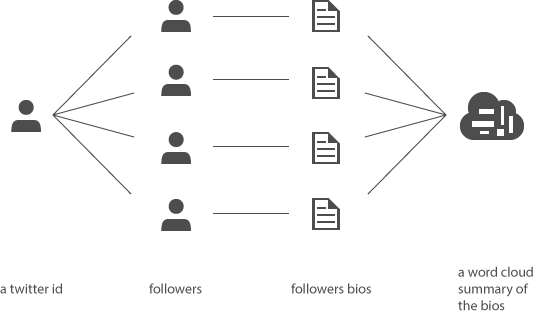

profilewords
------------

An idea to explore the profiles of followers on twitter.

[ This is an example of a word cloud of my follower's biographies ]

Sometimes in my user research for software tools, I like to look at profiles of twitter followers - to understand their roles, and motivations for choosing a technology.

But really there are so many interesting reasons to explore the followers of a user:

- To see if there is a commonality of followers - to see if the person tweets to a group you match
- To learn more about the network of a Twitter id, to research that person

I thought it would be a fun project to write some code to look for patterns en masse.

This is the concept:
 

Here's [an article explaining how I used it](http://goo.gl/IgzYUG "Blog about followers profiles of election candidates")  during an election to understand the candidates from their social media profiles.

Here's [my running app](http://goo.gl/VrHfLs "ProfileWords") - still experimental